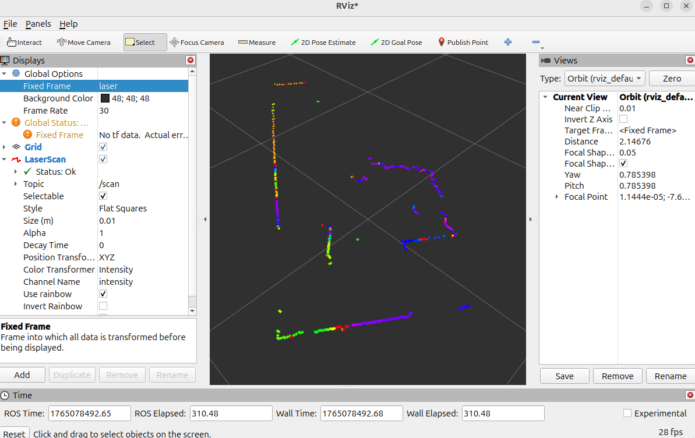
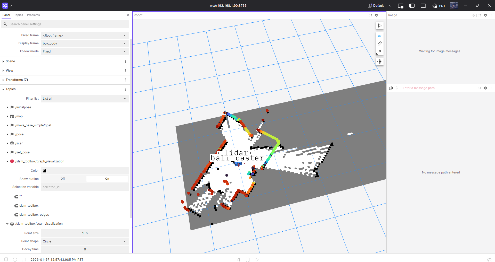
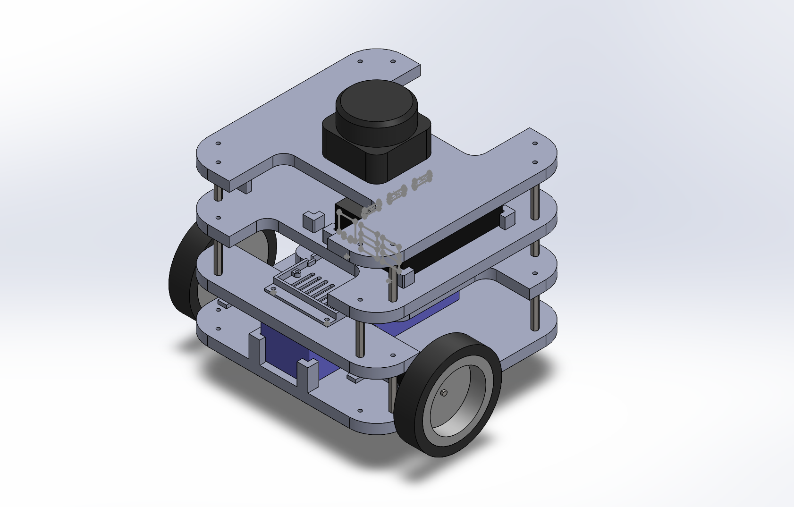
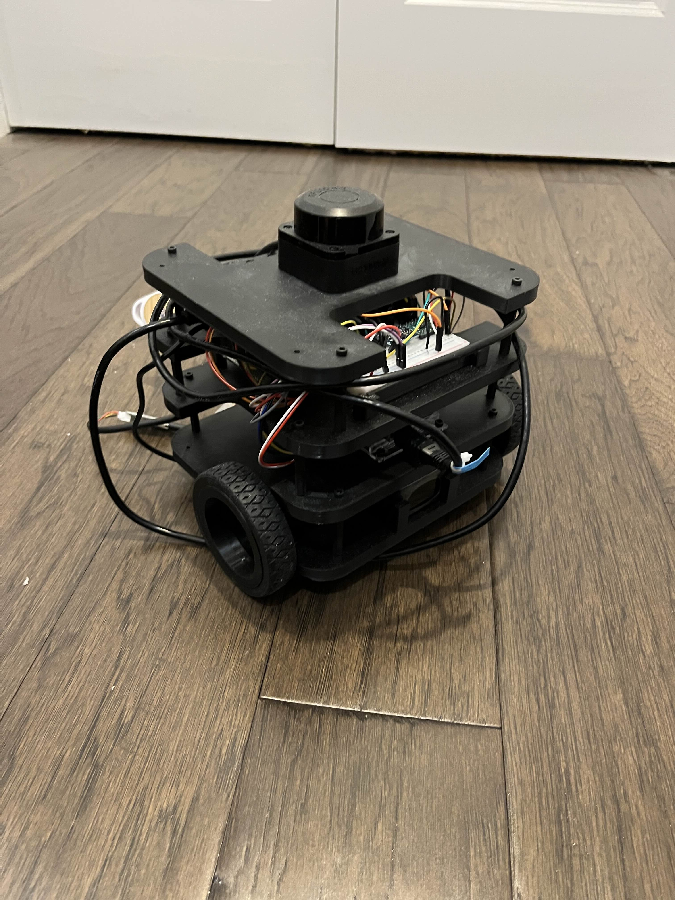
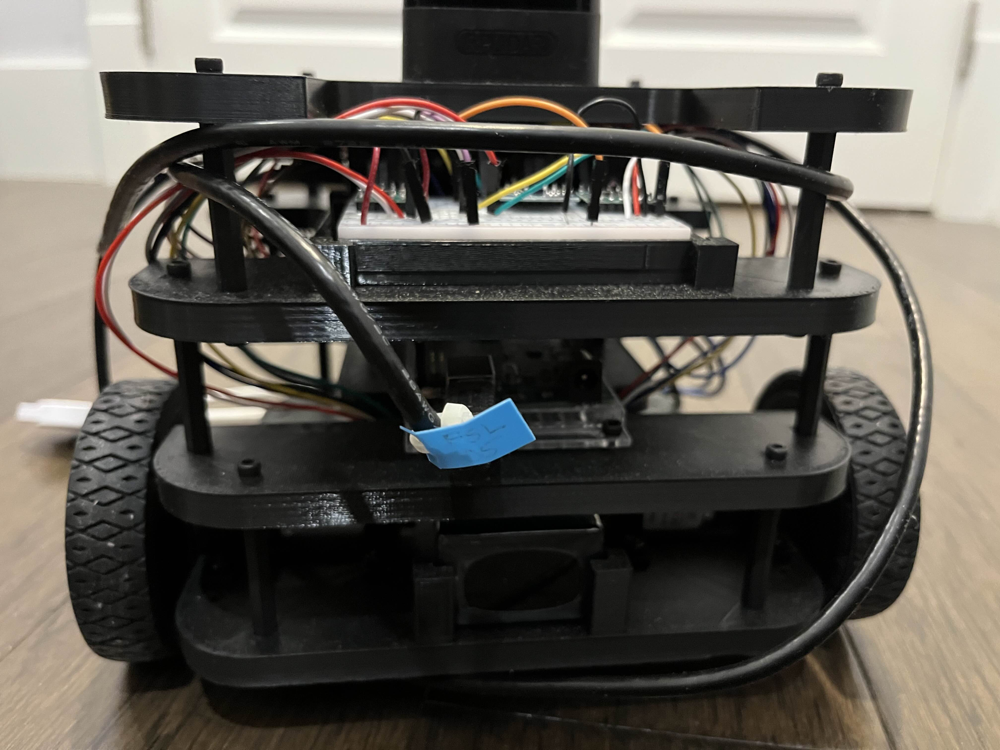
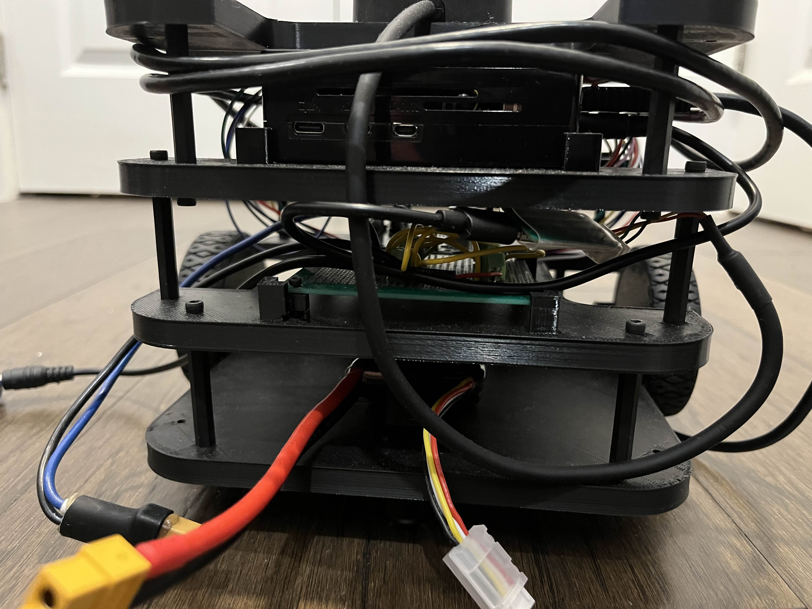

# Overview
Similar to Turtlebot 3

- Features
    - Raspberry Pi 5
    - Arduino
    - DC Motors
    - Odometry
        - Encoders
        - IMU
        - LiDAR
    - SLAM (w/ LiDAR)
    - Obstacle Avoidance with PPO

# Progress

Drone Moving
https://www.youtube.com/watch?v=rg7pI7mpyLs

## LiDAR
Visualized LiDAR information from Raspberry Pi onto Desktop using RViz2.

After I moved, I could not set up proper port forwarding at my dorm between my Raspberry Pi and my VM, so I switched to Foxglove.

Here is an example Map with my robot and LiDAR visualized on it.

## Assembly
Finished the CAD assembly, and built it in real life. 

